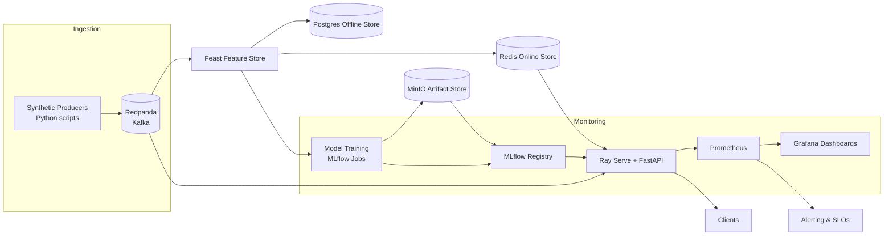
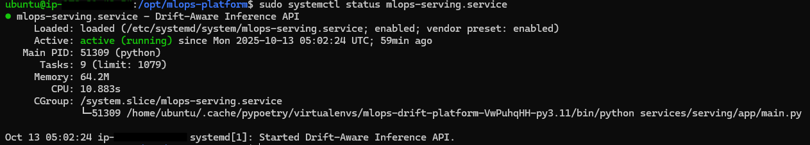
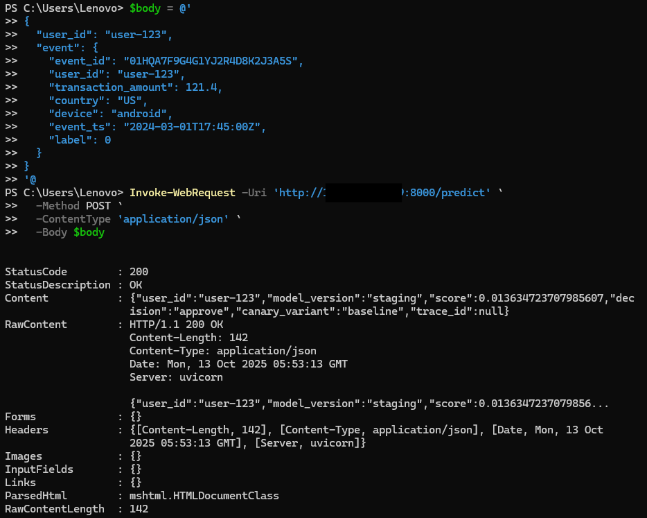
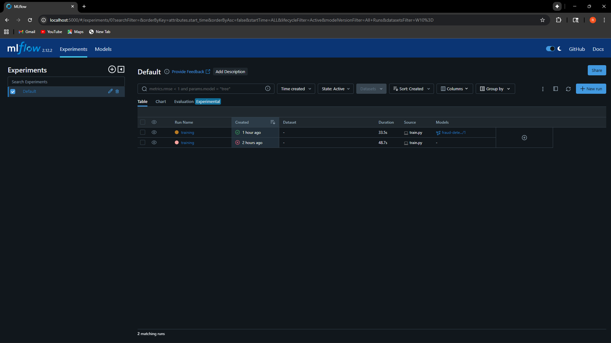
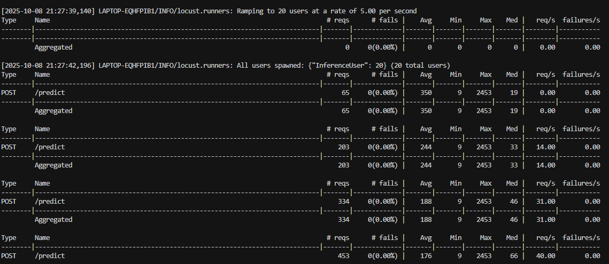

# Real-Time Drift-Aware ML Platform

  

> A runnable reference monorepo showcasing a real-time drift-aware ML platform. Local-first for fast iteration, plus a proven single-instance AWS deployment for recruiters and demos.



## Why this repo?

- Demonstrates an end-to-end feedback loop: synthetic events → Kafka (Redpanda) → Feast → model training → Ray Serve → drift monitoring.
- Canary + shadow deployments with rollback automation, Prometheus metrics, and OpenTelemetry tracing.
- Docker Compose powers the local stack; Terraform/Argo CD manifests show cloud extension points (clearly marked stubs).
- CI covers lint, tests, builds, and automated model gating; nightly drift job exports Evidently reports.

## Quickstart (local demo)

1. Install prerequisites: Docker, Docker Compose Plugin, Python 3.11, [Poetry](https://python-poetry.org), [make](https://www.gnu.org/software/make/).
2. `cp .env.example .env` and adjust credentials if needed.
3. `make bootstrap` – installs Python deps, hooks.
4. Launch infra: `make compose-up` (wait for services to become healthy).
5. Seed data & features:
   ```bash
   make data
   make feast-apply
   make materialize
   ```
6. Train & register baseline:
   ```bash
   make train
   make register
   ```
7. Start streaming & serving:
   ```bash
   make producer   # in a new terminal
   make serve      # Ray Serve + FastAPI ingress
   ```
8. Hit the inference API:
   ```bash
   curl -X POST "http://localhost:8000/predict" -H "Content-Type: application/json" \
     -d '{"user_id":"user-42","event":{"transaction_amount":83.2,"country":"DE","device":"ios","event_ts":"2024-03-01T12:00:00Z"}}'
   ```

Stop everything with `make compose-down`.

## AWS Deployment (single t4g.micro)

Need a lightweight cloud pitch? The platform runs end-to-end on a single AWS Arm instance (≈$10–$15/month) with Docker services and the FastAPI inference process supervised by `systemd`.

1. Provision an Ubuntu 22.04 `t4g.micro`, attach an Elastic IP, and lock security-group ingress to SSH + the ports you want to expose (e.g., 8000 for the API).  
   
2. SSH in, install Docker, Poetry, and clone this repo under `/opt/mlops-platform`.  
   `poetry install --without dev && docker compose -f infra/docker/docker-compose.yaml up -d`
3. Seed data, train, and register a baseline model:
   ```bash
   make data && make feast-apply && make materialize
   make train && make register
   ```
4. Run the inference API under `systemd` so it restarts on boot (unit file included in the repo README snippets).  
   
5. Point Prometheus at `172.17.0.1:8000`, generate traffic via the sample script, and refresh Grafana/MLflow over an SSH tunnel to confirm observability.  
   

### Cloud validation artifacts

- Public health & prediction responses from Windows client  
    
  
- Docker backing services up on the EC2 host  
  
- MLflow + Grafana dashboards accessed through SSH port forwarding (localhost tabs originate from the EC2 host)  
    
  

## Right-Sizing & Cost Controls

- Run only what you need: `docker compose -f infra/docker/docker-compose.yaml up -d postgres redis minio minio-setup mlflow` keeps persistence + model metadata while skipping observability extras like Prometheus, Grafana, the OTEL collector, or Redpanda Console. Add them back selectively when you need dashboards or traces.
- If streaming is optional, leave Redpanda and `make producer` turned off; rely on `make data` + Feast materialization to refresh features during local iterations and CI.
- Treat Evidently drift jobs and load testing (`make drift-report`, `make load-test`) as on-demand steps; comment out `ci/github/workflows/nightly-drift.yml` if it is burning minutes for teams without 24/7 monitors.
- After demos, `make compose-down` to free CPU/RAM; in AWS, `sudo systemctl disable --now mlops-platform.service` prevents the long-lived unit (see `infra/terraform/modules/ec2/user_data.sh`) from restarting the full stack automatically.
- Capture any deviations (disabled services, smaller compose files, alternative storage endpoints) in `docs/runbook.md` so others inherit the same cost-conscious footprint.

## Services & Ports

| Component             | Port | Notes |
|-----------------------|------|-------|
| FastAPI + Ray Serve   | 8000 | `/predict`, `/health`, `/metrics` (Prom) |
| Redpanda (Kafka API)  | 9092 | `transactions` topic |
| MinIO API / Console   | 9000 / 9001 | Bucket `mlops-demo` |
| MLflow UI             | 5000 | Tracking & registry |
| Prometheus            | 9090 | Scrapes serving, Ray, custom jobs |
| Grafana               | 3000 | Dashboards pre-provisioned |
| OpenTelemetry OTLP    | 4317 | Collector forwards to Tempo/Jaeger (stub) |
| Postgres              | 5432 | Feast offline store, MLflow backend |
| Redis                 | 6379 | Feast online store |

## Demo Flow

1. `scripts/generate_synthetic_data.py` populates `data/sample/events.csv` and uploads to MinIO.
2. Feast ingestion jobs (`batch_job.py` & `stream_job.py`) hydrate offline and online stores.
3. `services/model_training/train.py` trains a scikit-learn pipeline, logs to MLflow, and produces reference metrics.
4. `register.py` promotes top-performing model to Staging alias.
5. Ray Serve loads candidate + shadow models; `canary.py` controls traffic split, `shadow.py` mirrors requests.
6. Prometheus scrapes `/metrics`; Grafana dashboards highlight SLOs and canary distribution.
7. `monitoring/drift/run_evidently.py` compares live vs reference windows, exports HTML/JSON, triggers alerts via Prometheus `rules.yml`.

## Canary, Shadow, Rollback

- Canary ratio defined via `CANARY_SPLIT` env; metrics labelled `model_variant`.
- Shadow flow logs latency + error counters without impacting responses; results exported to MLflow for offline review.
- `rollback.py` polls Prometheus for SLO breaches (p95 latency > 200 ms, error rate > 1%); if tripped, it demotes canary and reinstates previous model.

## Observability

- OpenTelemetry instrumentation (`services/common/tracing.py`, `services/monitoring/tracing/otel_init.py`) emits spans for ingestion + inference.
- Grafana dashboards (`docs/dashboards/*.json`, `infra/docker/grafana/dashboards/*.json`) surface SLOs, drift risk, traffic mix.
- Evidently reports captured under `services/monitoring/drift/reports/` and linked in Grafana "Static" panel.

## Live Demo Gallery

Experience snapshots from the local stack (captured under `Images/`):

### Inference & Feature Store

- `make feast-apply` and `make materialize` bring Feast assets online  
  
- Live prediction response from `http://localhost:8000/predict`  
  

### Observability Dashboards

- Grafana Inference SLO dashboard tracking latency and request mix  
  
- Prometheus query for serving latency histogram  
  ).png)

### Cloud Deployment Highlights

- Systemd-managed FastAPI service on EC2  
  
- Public `/predict` validation via PowerShell  
  
- Grafana p95 latency after generating traffic on the instance  
  

### Model Lifecycle & Artifacts

- MLflow run showing registered model metrics  
  
- MinIO object browser with exported model artifacts  
  

### Load & Streaming

- Headless Locust run exercising `/predict`  
  
- Redpanda topics receiving synthetic transactions  
  

## Automation & CI

- `Makefile` orchestrates local workflows; run `make help` for a task overview.
- GitHub Actions (`ci/github/workflows/ci.yml`) run lint (`ruff`, `black --check`), unit tests (`pytest`), model validation (`evaluate.py`), Docker builds, and Compose smoke harness.
- `nightly-drift.yml` runs Evidently drift job on schedule and uploads HTML artifacts.
- `scripts/load_test_locustfile.py` hits `/predict` to validate throughput (target 2 k rps; local default lower).

## Testing & Regression Gates

- `make test-unit` exercises deterministic unit tests (canary logic, feature fallbacks, drift helpers).
- `make test-integration` stands up an in-process inference flow using synthetic events and Prometheus metrics.
- `make test-regression` runs marked regression tests plus drift and metric validation commands (expects `make train` to have produced `latest_metrics.json`).
- Sample drift fixtures live at `data/sample/drift_reference.csv` and `data/sample/drift_current.csv`; override paths with `DRIFT_REFERENCE_PATH` / `DRIFT_CURRENT_PATH`.

## API Examples

### curl
```bash
curl -s -X POST http://localhost:8000/predict \
  -H "Content-Type: application/json" \
  -d '{"user_id":"user-123","event":{"event_id":"01HQA7F9G4G1YJ2R4D8K2J3A5S","user_id":"user-123","transaction_amount":121.4,"country":"US","device":"android","event_ts":"2024-03-01T17:45:00Z","label":0}}' \
  | jq
```

### Python client
```python
import httpx
payload = {
    "user_id": "user-123",
    "event": {
        "event_id": "01HQA7F9G4G1YJ2R4D8K2J3A5S",
        "user_id": "user-123",
        "transaction_amount": 121.4,
        "country": "US",
        "device": "android",
        "event_ts": "2024-03-01T17:45:00Z",
        "label": 0,
    },
}
resp = httpx.post("http://localhost:8000/predict", json=payload, timeout=5.0)
resp.raise_for_status()
print(resp.json())
```

## FAQ

- **Why Redpanda?** Kafka-compatible broker with light local footprint.
- **Can I swap Feast backends?** Yes—toggle Postgres/Redis via `.env`. Cloud Terraform stubs illustrate AWS MSK + ElastiCache.
- **What about secrets?** `.env.example` documents required vars; repo never stores credentials. CI includes secret scanning hooks.
- **Production ready?** This is a local reference architecture; cloud manifests are illustrative only.

## Quick Tour

- Architecture diagram – `diagrams/architecture.png`
- Core code entry points - training (`services/model_training/train.py`), serving (`services/serving/app/main.py`), drift job (`services/monitoring/drift/run_evidently.py`)
- Canary/shadow logic - `services/serving/app/canary.py`, `services/serving/app/shadow.py`, `services/serving/app/rollback.py`
- Grafana dashboards - `docs/dashboards/`, `infra/docker/grafana/dashboards/`
- CI workflows – `ci/github/workflows/ci.yml`, `ci/github/workflows/nightly-drift.yml`
- Terraform & GitOps references – `infra/terraform/`, `manifests/`
- Operations Runbook – `docs/runbook.md`
